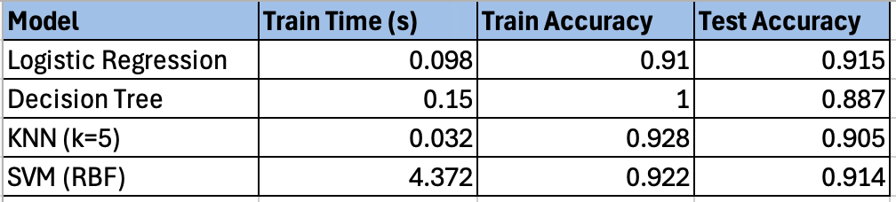
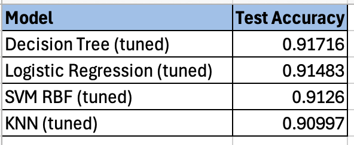
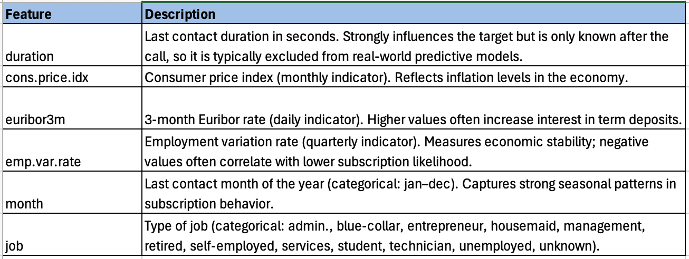
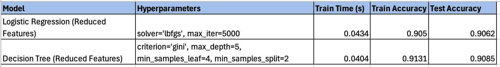

# Marketing Classifier Comparison

This project compares the performance of four supervised learning classifiers:

- K-Nearest Neighbors
- Logistic Regression
- Decision Trees
- Support Vector Machines

The dataset comes from a bank’s telephone marketing campaign.
The primary goal is to **evaluate model performance** and determine which classifier performs best under different conditions.

The secondary goal is to answer the business question:

**Which customers should we target in our marketing campaign to maximize term‑deposit subscriptions?**

Answering this allows us to predict which customers are most likely to say “Yes” to a term‑deposit subscription.

## Model Performance
Initial model comparison:

After hyperparameter tuning:

## Reduced Feature Set
To simplify the marketing campaign and improve interpretability, a reduced feature set was selected:

Logistic Regression and Decision Tree models were retrained using these features:

Both models outperformed the majority baseline (No = 88.7%).
Logistic Regression coefficients for the reduced model:

## Repository Structure

- [notebooks/](notebooks/) — Jupyter notebook containing the project  
- [data/](data/) — dataset (CSV, Excel file storage)  
- [images/](images/) — image storage  
