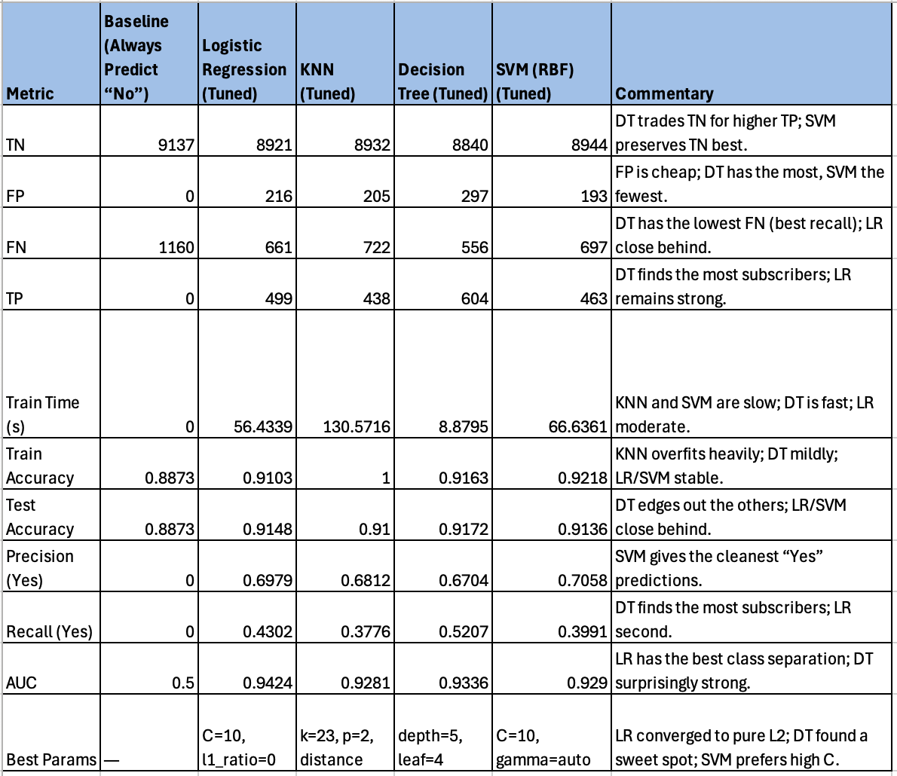
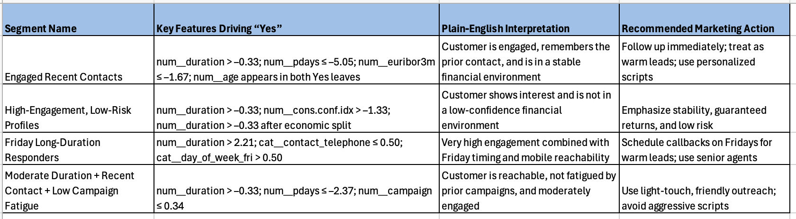

# Marketing Classifier Comparison

This project compares the performance of four supervised learning classifiers:

- K-Nearest Neighbors
- Logistic Regression
- Decision Trees
- Support Vector Machines

The dataset comes from a bank’s telephone marketing campaign.
The primary goal is to **evaluate model performance** and determine which classifier performs best under different conditions.

The secondary goal is to answer the business question:

**Which customers should we target in our marketing campaign to maximize term‑deposit subscriptions?**

Answering this allows us to predict which customers are most likely to say “Yes” to a term‑deposit subscription.

## Model Performance
Here's the summary of model performance (including the baseline model with tuned parameters):

## Model Chosen - the Decision Tree

Given the business problem, and the importance of Recall (YES) the Decision Tree model 
was chosen as the model that best answers the business question.  Accordingly, here's the Decision Tree model 
derived marketing guide for targeting customers:

## Repository Structure

- [notebooks/](notebooks/) — Jupyter notebook containing the project  
- [data/](data/) — dataset (CSV, Excel file storage)  
- [images/](images/) — image storage  
